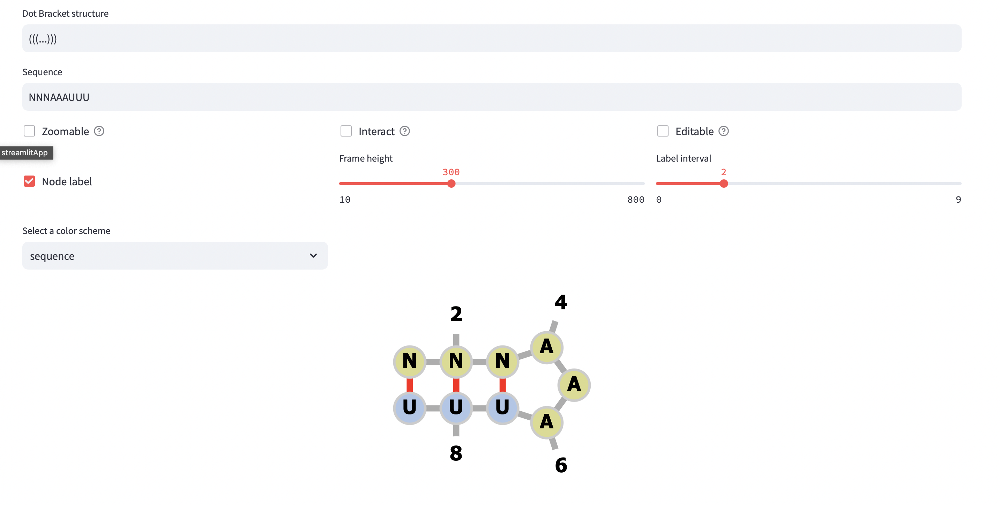

# Forna Component

RNA Secondary Structure Visualization Using a Force Directed Graph Layout

This is a simple component that renders a [forna diagram](https://github.com/ViennaRNA/fornac.git). It is a wrapper around the [forna container](https://github.com/ViennaRNA/fornac.git).

## Installation

```
pip install st_forna_component
```

## Example



Look at the [example](https://fornacomponent.streamlit.app/) for a simple example:

[](https://fornacomponent.streamlit.app/)

## Usage

```
import streamlit as st
from st_forna_component import forna_component

return_value = forna_component(
                                structure = '((((....))))', # RNA structure
                                sequence =  'AAAAUUCGUUUU', # RNA sequence
                                height = 400, # height of the component
                                animation = animation, # boolean to enable animation/interactivity
                                zoomable = zoomable, # boolean to enable zooming
                                label_interval = label_interval, # interval for numbering the nucleotides
                                node_label = node_label, # boolean to enable node labeling
                                editable = editable, # boolean to enable editing
                                color_scheme = color_scheme, # color scheme for the nucleotides: options are 'structure', 'sequence', 'positions', 'custom'
                                colors = colors, # custom colors for the nucleotides: string with space separated index:color pairs
                                )

 
st.write("Received value:", return_value) 
# Returns None if no changes were made. 
# When clicked on the component, it returns the current structure and sequence 
# In case of cofold, it return a unique string without the separator '&'

```

## How to cite:

Please include this citation if the Forna Component is used in an academic study:

```
Lucandia. Lucandia/st_forna_component; Zenodo, 2024. https://zenodo.org/doi/10.5281/zenodo.11181680.
```

[](https://zenodo.org/doi/10.5281/zenodo.11181680)

## License

Code is licensed under the GNU General Public License v3.0 ([GPL-3.0](https://www.gnu.org/licenses/gpl-3.0.en.html))

[](https://www.gnu.org/licenses/gpl-3.0.en.html)


